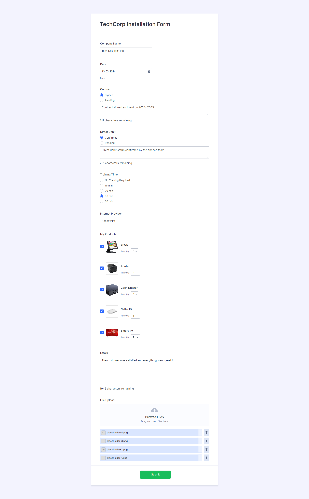
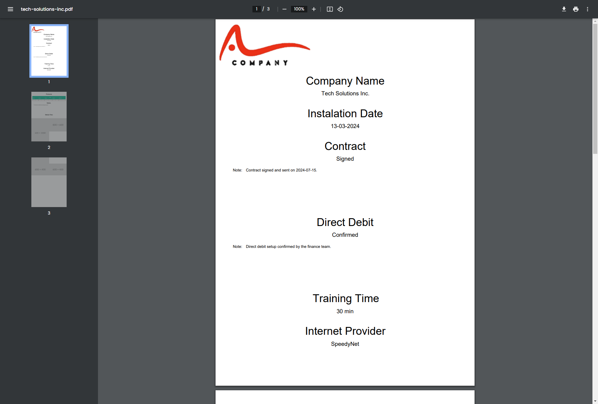
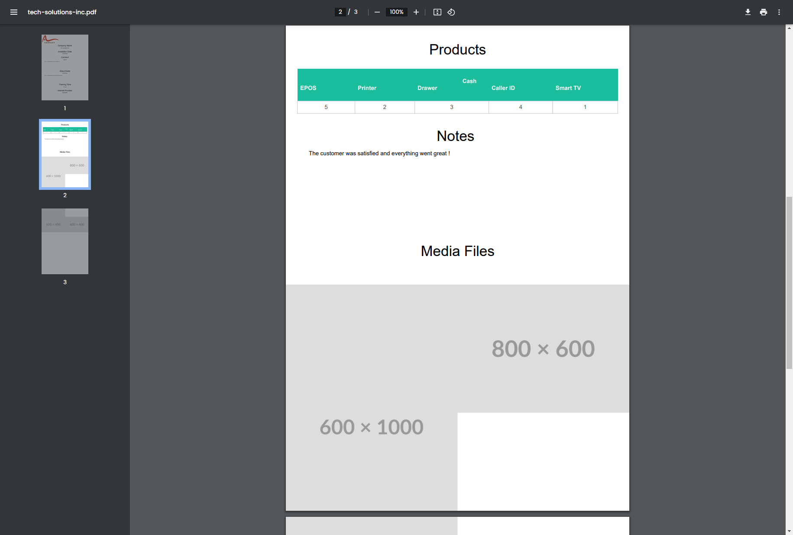
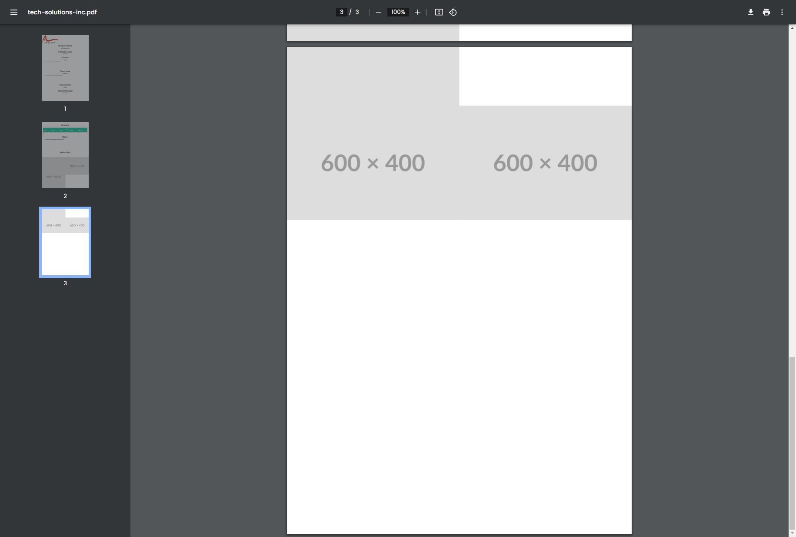

# TechCorp Installation Form

## Description

The TechCorp Install form is a web-based, business-specific application that focuses on collecting detailed company information for TechCorp products installed. We get company information, information about how the installation was done, the contract status details, whether debit was authorized for example concerning bank account number, training requirements for instance time frame in which training will take place, what time a business prefers training to be carried out etc), name of internet service provider among others, as well as the choice of products being introduced. Such systematized disposition of activities ensures smooth data collection without complicating anything but rather exporting it into PDF format.

## Adding Your Logo

To change the logo in the PDF export, upload your logo to the URL below and copy the Base64 code:
[Base64 Image Upload](https://www.base64-image.de/)

Include the Base64 code in the relevant section of your script to ensure your logo appears in the exported PDF.

## Form Features

-  **Company Information**: Collect the name of the company.
-  **Installation Details**: Record the installation date.
-  **Contract Status**: Track the status of the contract (signed or pending) and any relevant notes.
-  **Direct Debit Confirmation**: Confirm if the direct debit has been set up, with additional notes if necessary.
-  **Training Requirements**: Specify the required training duration.
-  **Internet Provider**: Record the name of the internet provider.
-  **Product Selection**: Select the quantity of various products like EPOS, printers, cash drawers, caller IDs, and smart TVs.

## Libraries and Technologies Used

### JavaScript Libraries

-  [jQuery](https://jquery.com/): A fast, small, and feature-rich JavaScript library.
-  [Bootstrap](https://getbootstrap.com/): A powerful front-end framework for faster and easier web development.
-  [jqBootstrapValidation](https://github.com/ReactiveRaven/jqBootstrapValidation): A plugin for adding validation to Bootstrap forms.
-  [jsPDF](https://github.com/parallax/jsPDF): A library to generate PDFs in JavaScript.
-  [jsPDF AutoTable](https://github.com/simonbengtsson/jsPDF-AutoTable): A plugin for jsPDF to generate tables in PDFs.
-  [DM Uploader](https://github.com/danielm/uploader): A file upload plugin for jQuery.
-  [html2canvas](https://github.com/niklasvh/html2canvas): A library that allows you to take screenshots of web pages.
-  [Flatpickr](https://flatpickr.js.org/): A lightweight and powerful datetime picker.

### CSS Libraries

-  [Flatpickr CSS](https://flatpickr.js.org/): Styles for the Flatpickr datetime picker.
-  [Bootstrap Grid CSS](https://getbootstrap.com/docs/4.0/layout/grid/): The grid system from Bootstrap for responsive layouts.

## Installation

To run this project, follow these steps:

1. Clone the repository:
   ```bash
   git clone https://github.com/your-username/techcorp-installation-form.git
   cd techcorp-installation-form
   ```
2. Open the `index.html` file in your web browser.

## Usage

Fill out the form fields as required:

-  **Company Name**: Enter the company name.
-  **Date**: Pick the installation date using the date picker.
-  **Contract Status**: Check the appropriate contract status and provide any notes.
-  **Direct Debit Confirmation**: Confirm direct debit status and provide any notes.
-  **Training Requirements**: Choose the training duration required.
-  **Internet Provider**: Enter the name of the internet provider.
-  **Product Selection**: Select the quantities for EPOS, printers, cash drawers, caller IDs, and smart TVs.

After filling out the form, submit it to process the data and save the exported PDF.

## Screenshots

### Form



### PDF Format





## Contributing

Contributions are welcome! Please open an issue or submit a pull request with any enhancements or bug fixes.

## License

This project is licensed under the MIT License. See the [LICENSE](LICENSE) file for details.
